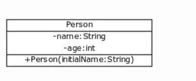
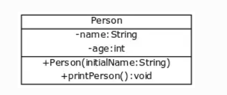

# MOOC JAVA NOTES

## PART 1
### Getting started with programming
Here are some things you learned:

How to install the necessary software for programming in Java<br>
The basics of programming<br>
How to use the Eclipse IDE

```java
public class HelloWorld {
  public static void main(String[] args) {
    System.out.println("Hello, World!");
  }
}
```
### Printing
This is an article about teaching Java programming. It discusses printing text to the console. The important thing they teach is that programmers should use comments to make their code easier to understand. They also teach that programmers should use semicolons to separate commands.

### Reading Inputs

```java
// Introduce the scanner tool used for reading user input
import java.util.Scanner;

public class Program {

    public static void main(String[] args) {
        // Create a tool for reading user input and name it scanner
        Scanner scanner = new Scanner(System.in);

        // Print "Write a message: "
        System.out.println("Write a message: ");

        // Read the string written by the user, and assign it
        // to program memory "String message = (string that was given as input)"
        String message = scanner.nextLine();

        // Print the message written by the user
        System.out.println(message);
    }
}
```
```java
    String message = "Hello world!";
System.out.println("message"); 
```
In general, you should use the scanner.nextLine() method if you need to perform additional processing on the input stream, such as skipping whitespace characters or delimiting tokens. If you simply need to read a line of text from the input stream, you can use either the reader.nextLine() method or the scanner.nextLine() method.

```java
//Introduce the Scanner tool used for reading
import java.util.Scanner;

public class Program {

    public static void main(String[] args) {

        //Create the tool for reading, assign it to variable caller "scanner
        Scanner scanner = new Scanner(System.in);

        //Print user a message "Write a message: "
        System.out.println("Write a message: ");

        //Read the user's string input, save it to program memory
        //"String message = (user input)"
        String message = scanner.nextLine();

        // Print the user input twice
        System.out.println(message);
        System.out.println(message);
    }
}
```
### variable 
Variables are used to store data in Java.
There are eight primitive data types in Java: byte, short, int, long, float, double, char, and boolean.
Variables are declared using the var keyword, followed by the variable name and data type.
Variables are initialized using the assignment operator (=).
Variable names should be descriptive and start with a lowercase letter.
```java
int number = 123;
System.out.println("The value of the variable is " + number);

number = 42;
System.out.println("The value of the variable is " + number);
```
```java
String valueAsString = "42";
int value = Integer.valueOf(valueAsString);

System.out.println(value);
```
Boolean.valueOf.

Boolean variables can either have the value true or false. When converting a string to a boolean, the string must be "true" if we want the boolean value to be true. The case is insensitive here: both "true" and "TRue" turn into the boolean value of true. All other strings turn into the boolean false.

### Calculating with numbers
BODMAS
integer division gives the integer output nearest roundoff
if one of them is float the answer will be in float
also
```java
int first = 3;
int second = 2;

double result1 = (double) first / second;
System.out.println(result1); // prints 1.5

double result2 = first / (double) second;
System.out.println(result2); // prints 1.5

double result3 = (double) (first / second);
System.out.println(result3); // prints 1.0
```
The last example produces an incorrectly rounded result, because the integer division is executed before the type casting.

### Conditional statements and conditional operation
The comparisons are executed top down. When execution reaches a conditional statement whose condition is true, its block is executed and the comparison stops.

Even though we can compare integers, floating point numbers, and boolean values using two equals signs (variable1 == variable2), we cannot compare the equality of strings using two equals signs.

```java
if (input.equals("a string")) {
    System.out.println("Great! You read the instructions correctly.");
} else {
    System.out.println("Missed the mark!");
}
```
and &&, or ||, and not ! are used.

## PART 2
### Recurring problems and patterns to solve them
If the variable used to store the data is introduced within the loop, the variable is only available within that loop and nowhere else.
### more loops
```java
for (int i = 0; i < 10; i++) {
    System.out.println(i);
}
```
1) introducing the variable for counting the number of executions; <br>(2) the condition of the loop; <br>(3) increasing (or decreasing or changing) the value of the counter variable; and <br>(4) the functionality to be executed.
 ```java
 result += 3; // shorthand for result = result + 3
 ```
 ### Methods and dividing the program into smaller parts
 The void keyword specifies that a method should not have a return value.
 
 Static:- it is access modifier that means when the java program is load then it will create the space in memory automatically.

The return value does not need to be entirely pre-defined - it can also be calculated. The return command that returns a value from the method can also be given an expression that is evaluated before the value is returned.

As we noticed earlier, other methods can be called from within methods.

## PART 3
### Discovering errors
### Lists
import java.util.ArrayList; 
```java
// import the list so the program can use it
import java.util.ArrayList;

public class Program {

    public static void main(String[] args) {
        // create a list
        ArrayList<String> list = new ArrayList<>();

        // the list isn't used yet
    }
}
```
get() <br> add() <br> remove() <br> size() <br> isEmpty() <br> clear()

f you try to retrieve information from a place that does not exist on the list, the program will print a IndexOutOfBoundsException error.
```java
ArrayList<String> teachers = new ArrayList<>();


teachers.add("Simon");
teachers.add("Samuel");
teachers.add("Ann");
teachers.add("Anna");

for (String teacher: teachers) {
    System.out.println(teacher);
}
```
```java
int[] numbers = new int[3];
```
```java
Scanner reader = new Scanner(System.in);

int[] numbers = new int[5];
numbers[0] = 42;
numbers[1] = 13;
numbers[2] = 12;
numbers[3] = 7;
numbers[4] = 1;

System.out.println("Which index should we access? ");
int index = Integer.valueOf(reader.nextLine());

int number = numbers[index];
System.out.println(number);
```
length <Br>
ArrayIndexOutOfBoundsException.<Br>
(typeofelements[])
```java
 String[] months = new String[12]
 double[] approximations = new double[100];
```
```java
public static void listElements(int[] integerArray) {
    System.out.println("the elements of the array are: ");
    int index = 0;
    while (index < integerArray.length) {
        int number = integerArray[index];
        System.out.print(number + " ");
        index = index + 1;
    }

    System.out.println("");
}   
```
```java
int[] numbers = {100, 1, 42}; ///shorter way to create an array
```
### Using strings
```java
tring text = "first second third fourth";
String[] pieces = text.split(" ");
System.out.println(pieces[0]);
System.out.println(pieces[1]);
System.out.println(pieces[2]);
System.out.println(pieces[3]);

System.out.println();

for (int i = 0; i < pieces.length; i++) {
    System.out.println(pieces[i]);
}
```
String.contains()
## PART 4
### Introduction to object-oriented programming
CLASS
```java
public class Person {
    private String name;
    private int age;
}
```
METHOD
```java
public class Person {
    private String name;
    private int age;

    public Person(String initialName) {
        this.age = 0;
        this.name = initialName;
    }
}
```
```java
public class Person {
    private String name;
    private int age;

    public Person(String initialName) {
        this.age = 0;
        this.name = initialName;
    }

    public void printPerson() {
        System.out.println(this.name + ", age " + this.age + " years");
    }
}
```
### Objects in a list
### Files and reading data
file reading 
try and catch
```java
// we create a scanner for reading the file
try (Scanner scanner = new Scanner(Paths.get("henkilot.csv"))) {

    // we read all the lines of the file
    while (scanner.hasNextLine()) {
        String line = scanner.nextLine();

        // if the line is blank we do nothing
        if (line.isEmpty()) {
            continue;
        }

        // do something with the data

    }
} catch (Exception e) {
    System.out.println("Error: " + e.getMessage());
}
```
### Part 5
#### Learning object-oriented programming
Object-oriented programming is primarily about isolating concepts into their own entities or, in other words, creating abstractions

class
A class defines the types of objects that can be created from it. It contains instance variables describing the object's data, a constructor or constructors used to create it, and methods that define its behavior. A rectangle class is detailed below which defines the functionality of a rectangle.

 <br>  constructor <br> object

### Removing repetitive code (overloading methods and constructors)

```java
public Person(String name) {
    this(name, 0);
    //here the code of the second constructor is run, and the age is set to 0
}

public Person(String name, int age) {
    this.name = name;
    this.age = age;
    this.weight = 0;
    this.height = 0;
}
```
### Primitive and reference variables
```java
Name luke = new Name("Luke");
System.out.println(luke);

///Sample output
///Name@4aa298b7
```
public String toString()

Reference Variables
All of the variables provided by Java (other than the eight primitive variables mentioned above) are reference type. A programmer is also free to create their own variable types by defining new classes. In practice, any object instanced from a class is a reference variable.

### Objects and references
```java
public class Person {

    private String name;
    private int age;
    private int weight;
    private int height;

    public Person(String name) {
        this(name, 0, 0, 0);
    }

    public Person(String name, int age, int height, int weight) {
        this.name = name;
        this.age = age;
        this.weight = weight;
        this.height = height;
    }

    // other constructors and methods

    public String getName() {
        return this.name;
    }

    public int getAge() {
        return this.age;
    }

    public int getHeight() {
        return this.height;
    }

    public void growOlder() {
        this.age = this.age + 1;
    }

    public void setHeight(int newHeight) {
        this.height = newHeight;
    }

    public void setWeight(int newWeight) {
        this.weight = newWeight;
    }

    public double bodyMassIndex() {
        double heightPerHundred = this.height / 100.0;
        return this.weight / (heightPerHundred * heightPerHundred);
    }

    @Override
    public String toString() {
        return this.name + ", age " + this.age + " years";
    }
}
```
Person ball = joan;
null value of a reference variable
Printing a null reference prints "null". How about if we were to try and call a method, say growOlder, on an object that refers to nothing:

NullPointerException.

Object as a method's return value
```java
public class Counter {
    private int value;

    // example of using multiple constructors:
    // you can call another constructor from a constructor by calling this
    // notice that the this call must be on the first line of the constructor
    public Counter() {
        this(0);
    }

    public Counter(int initialValue) {
        this.value = initialValue;
    }

    public void increase() {
        this.value = this.value + 1;
    }

    public String toString() {
        return "value: " + value;
    }

    public Counter clone() {
        // create a new counter object that receives the value of the cloned counter as its initial value
        Counter clone = new Counter(this.value);

        // return the clone to the caller
        return clone;
    }
}
```
## PART 6
### Objects on a list and a list as part of an object
Objects in an Instance Variable List
Printing an Object from a List
Clearing an Object's List
Calculating a Sum from Objects on a List
### Separating the user interface from program logic
Looping and quitting

Proceed with small steps

Try to separate the program into several sub-problems and work on only one sub-problem at a time
Always test that the program code is advancing in the right direction, in other words: test that the solution to the sub-problem is correct
Recognize the conditions that require the program to work differently. In the example above, we needed a different functionality to test whether a word had been already entered before.
Write as "clean" code as possible

Indent your code
Use descriptive method and variable names
Don't make your methods too long, not even the main method
Do only one thing inside one method
Remove all copy-paste code
Replace the "bad" and unclean parts of your code with clean code
### Introduction to testing
Stack Trace

Indent your code properly and find out if there are any missing parentheses.
Verify that the variables used are correctly named.
Test the program flow with different inputs and find out the sort of input that causes the program to not work as desired. If you received an error in the tests, the tests may also indicate the input used.
Add print commands to the program in which you print out the values of the variables used at various stages of the program's execution.
Verify that all variables you are using are initialized. If they aren't, a NullPointerException error will occur.
If your program causes an exception, you should definitely pay attention to the stack trace associated with the exception, which is the list of method calls that resulted in the situation that caused the exception.
Learn how to use the debugger. The earlier video will get you started.

Unit Testing

### Complex programs

## PART 7
### Programming paradigms
A programming paradigm is a way of thinking about and structuring a program's functionality. Programming paradigms differ from one another, for example in how the program's execution and control are defined and what components the programs consist of.

Most programming languages ​​that are currently in use support multiple programming paradigms. Part of a programmer's growth involves the ability, through experience, to choose the appropriate programming language and paradigm; there currently is no single ubiquitous programming language and programming paradigm.

The most common programming paradigms today are object-oriented programming, procedural programming, and functional programming. The first two of these are briefly discussed in what follows.
### Algorithms
Sorting information<br>
    Selection sort <Br>
    Linear search<br>
    Binary search<br>
### Larger programming exercises
### Conclusion
## PART 8
### Short recap
### Hash Map
A HashMap is, in addition to ArrayList, one of the most widely used of Java's pre-built data structures. The hash map is used whenever data is stored as key-value pairs, where values can be added, retrieved, and deleted using keys.
```java
HashMap<String, String> postalCodes = new HashMap<>();
postalCodes.put("00710", "Helsinki");
postalCodes.put("90014", "Oulu");
postalCodes.put("33720", "Tampere");
postalCodes.put("33014", "Tampere");

System.out.println(postalCodes.get("00710"));
```
put(*key*, *value*)<br>
get()
```java
Book book = directory.get("Persuasion");
System.out.println(book);
System.out.println();
book = directory.get("Pride and Prejudice");
System.out.println(book);
```
Hash Map as an Instance Variable<br>
Going Through A Hash Map's Keys
<br>Going Through A Hash map's Values
<br>default V getOrDefault(Object key, V defaultValue)
## Similarity of objects
Method to Test For Equality - "equals"<br>
```java
public class Book {
    private String name;
    private String content;
    private int published;

    public Book(String name, int published, String content) {
        this.name = name;
        this.published = published;
        this.content = content;
    }

    public String getName() {
        return this.name;
    }

    public void setName(String name) {
        this.name = name;
    }

    public int getPublished() {
        return this.published;
    }

    public void setPublished(int published) {
        this.published = published;
    }

    public String getContent() {
        return this.content;
    }

    public void setContent(String content) {
        this.content = content;
    }

    public String toString() {
        return "Name: " + this.name + " (" + this.published +   ")\n"
            + "Content: " + this.content;
    }

    @Override
    public boolean equals(Object comparedObject) {
        // if the variables are located in the same place, they're the same
        if (this == comparedObject) {
            return true;
        }

        // if comparedObject is not of type Book, the objects aren't the same
        if (!(comparedObject instanceof Book)) {
            return false;
        }

        // let's convert the object to a Book-object
        Book comparedBook = (Book) comparedObject;

        // if the instance variables of the objects are the same, so are the objects
        if (this.name.equals(comparedBook.name) &&
            this.published == comparedBook.published &&
            this.content.equals(comparedBook.content)) {
            return true;
        }

        // otherwise, the objects aren't the same
        return false;
    }
}
```
Let's review the ideas once more: for a class to be used as a HashMap's key, we need to define for it:

the equals method, so that all equal or approximately equal objects cause the comparison to return true and all false for all the rest
the hashCode method, so that as few objects as possible end up with the same hash value

Grouping data using hash maps <br>
Fast data fetching and grouping information
## PART 9
### Class inheritance
```java
public class Engine extends Part {

    private String engineType;

    public Engine(String engineType, String identifier, String manufacturer, String description) {
        super(identifier, manufacturer, description);
        this.engineType = engineType;
    }

    public String getEngineType() {
        return engineType;
    }
}
```
Calling the constructor of the superclass
<br>Calling a superclass method
```java
@Override
public String toString() {
    return super.toString() + "\n  And let's add my own message to it!";
}
```
```java
public class Counter {

    public int addToNumber(int number) {
        return number + 1;
    }
    
    public int subtractFromNumber(int number) {
        return number - 1;
    }
}

----------------------

public class SuperCounter extends Counter {

    @Override
    public int addToNumber(int number) {
        return number + 5;
    }
    
}

----------------------

public static void main(String[] args) {
    Counter counter = new Counter();
    Counter superCounter = new SuperCounter();
    int number = 3;
    number = superCounter.subtractFromNumber(number);
    number = superCounter.subtractFromNumber(number);
    number = counter.addToNumber(number);
    System.out.println(number);
}
```
### Interfaces
# incomplete:
### Object polymorphism
```java
String text = "text";
Object textString = "another string";
```
```java
String text = "text";
Object textString = text;
```
```java
Object textString = "another string";
String text = textString; // WON'T WORK!
```
he inheritance hierarchy lists all the classes that the given class has inherited. Inherited classes are listed in the order of inheritance, with class being inspected always at the bottom. In the inheritance hierarchy of the String class, we see that the String class inherits the Object class. In Java, each class can inherit one class at most. On the other hand, the inherited class may have inherited another class. As such, a class may indirectly inherit more than a single class.

The inheritance hierarchy can also be thought of as a list of the different types that the class implements.

The String class implements the Serializable, CharSequence, and Comparable <String> interfaces. An interface is also a type. According to the class' API description, the following interfaces can be set as the type of a String object.
<br>
```java
Serializable serializableString = "string";
CharSequence charSequenceString = "string";
Comparable<String> comparableString = "string";
```
Since we're able to define the type of a method's parameter, we can declare methods that receive an object that implements a specific interface. When a method's parameter is an interface, any object that implements that interface can be passed to it as an argument.

We'll extend the Printer class so that it has a method for printing the characters of objects that implement the CharSequence interface. The CharSequence interface provides, among other things, methods int length() for getting a string's length and char charAt(int index), which retrieves a character from a given index.
```java
public class Printer {

    public void printManyTimes(Object object, int times) {
        int i = 0;
        while (i < times) {
            System.out.println(object);
            i = i + 1;
        }
    }

    public void printCharacters(CharSequence charSequence) {
        int i = 0;
        while (i < charSequence.length()) {
            System.out.println(charSequence.charAt(i));
            i = i + 1;
        }
    }
}
```
## PART 10
### Handling collections as streams
```java
// We initialise the scanner and the list into which the input is read
Scanner scanner = new Scanner(System.in);
List<String> inputs = new ArrayList<>();

// reading inputs
while (true) {
    String row = scanner.nextLine();
    if (row.equals("end")) {
        break;
    }

    inputs.add(row);
}

// counting the number of values divisible by three
long numbersDivisibleByThree = inputs.stream()
    .mapToInt(s -> Integer.valueOf(s))
    .filter(number -> number % 3 == 0)
    .count();

// working out the average
double average = inputs.stream()
    .mapToInt(s -> Integer.valueOf(s))
    .average()
    .getAsDouble();

// printing out the statistics
System.out.println("Divisible by three " + numbersDivisibleByThree);
System.out.println("Average number: " + average);
```
A stream can be formed from any object that implements the Collection interface (e.g., ArrayList, HashSet, HashMap, ...) with the stream() method. The string values ​​are then converted ("mapped") to integer form using the stream's mapToInt(value -> conversion) method. The conversion is implemented by the valueOf method of the Integer class, which we've used in the past. We then use the filter (value -> filter condition) method to filter out only those numbers that are divisible by three for further processing. Finally, we call the stream's count() method, which counts the number of elements in the stream and returns it as a long type variable.

Lambda Expressions
```jav
// Lambda expression to add two numbers
BinaryOperator<Integer> add = (a, b) -> a + b;

```
Stream Methods
```java
List<Integer> list = new ArrayList<>();
list.add(3);
list.add(7);
list.add(4);
list.add(2);
list.add(6);

ArrayList<Integer> values = list.stream()
    .filter(value -> value > 5)
    .map(value -> value * 2)
    .collect(Collectors.toCollection(ArrayList::new));
```
Terminal Operations
Let's take a look at four terminal operations: the count method for counting the number of values on a list, the forEach method for going a through list values, the collect method for gathering the list values ​​into a data structure, and the reduce method for combining the list items.
```java
// suppose we have a list of persons
// ArrayList<Person> persons = new ArrayList<>();

long count = persons.stream()
    .filter(person -> person.getFirstName().startsWith("A"))
    .count();
System.out.println("Count: " + count);
```
Objects and Stream
```java
// let's assume that we have a list of books
// List<Book> books = new ArrayList<>();

double average = books.stream()
    .map(book -> book.getAuthor())
    .mapToInt(author -> author.getBirthYear())
    .average()
    .getAsDouble();

System.out.println("Average of the authors' birth years: " + average);

// the mapping of a book to an author could also be done with a single map call
// double average = books.stream()
//     .mapToInt(book -> book.getAuthor().getBirthYear())
//     ...
```
Files and Streams
```java
List<String> rows = new ArrayList<>();

try {
    Files.lines(Paths.get("file.txt")).forEach(row -> rows.add(row));
} catch (Exception e) {
    System.out.println("Error: " + e.getMessage());
}

// do something with the read lines
```
### The Comparable Interface
```java
List<Member> member = new ArrayList<>();
member.add(new Member("mikael", 182));
member.add(new Member("matti", 187));
member.add(new Member("ada", 184));

member.stream().forEach(m -> System.out.println(m));
System.out.println();
// sorting the stream that is to be printed using the sorted method
member.stream().sorted().forEach(m -> System.out.println(m));
member.stream().forEach(m -> System.out.println(m));
// sorting a list with the sort-method of the Collections class
Collections.sort(member);
member.stream().forEach(m -> System.out.println(m));
```
multiple interface with ,
<br> Sorting Method as a Lambda Expression
```java
ArrayList<Person> persons = new ArrayList<>();
persons.add(new Person("Ada Lovelace", 1815));
persons.add(new Person("Irma Wyman", 1928));
persons.add(new Person("Grace Hopper", 1906));
persons.add(new Person("Mary Coombs", 1929));

persons.stream().sorted((p1, p2) -> {
    return p1.getBirthYear() - p2.getBirthYear();
}).forEach(p -> System.out.println(p.getName()));

System.out.println();

persons.stream().forEach(p -> System.out.println(p.getName()));

System.out.println();

Collections.sort(persons, (p1, p2) -> p1.getBirthYear() - p2.getBirthYear());

persons.stream().forEach(p -> System.out.println(p.getName()));
```
### Other useful techniques
StringBuilder
String creation - although unnoticeable at a small scale - is not a quick operation. Space is allocated in memory for each string where the string is then placed. If the string is only needed as part of creating a larger string, performance should be improved.

Java's ready-made StringBuilder class provides a way to concatenate strings without the need to create them. A new StringBuilder object is created with a new StringBuilder() call, and content is added to the object using the overloaded append method, i.e., there are variations of it for different types of variables. Finally, the StringBuilder object provides a string using the toString method.

In the example below, only one string is created.
```java
StringBuilder numbers = new StringBuilder();
for (int i = 1; i < 5; i++) {
    numbers.append(i);
}
System.out.println(numbers.toString());
```
Regular Expressions
```java
System.out.print("Provide a student number: ");
String number = scanner.nextLine();

if (number.matches("01[0-9]{7}")) {
    System.out.println("Correct format.");
} else {
    System.out.println("Incorrect format.");
}
```
Alternation (Vertical Line)
```java
String string = "1111";

if (string.matches("00|111|0000")) {
    System.out.println("The string contained one of the three alternatives");
} else {
    System.out.println("The string contained none of the three alternatives");
}
```
Quantifiers
```java
String string = "trolololololo";

if (string.matches("trolo(lo)*")) {
    System.out.println("Correct form.");
} else {
    System.out.println("Incorrect form.");
}
```
The quantifier + repeats 1 ... times, for example;<br>
The quantifier * repeats 0 ... times, for example;
<br>The quantifier {a} repeats a times, for example:
<br>The quantifier {a,b} repeats a ... b times, for example:
<br>The quantifier {a,} repeats a ... times, for example:
<br>

Character Classes (Square Brackets)
```java
public enum Suit {
    DIAMOND, SPADE, CLUB, HEART
}

public class Card {

    private int value;
    private Suit suit;

    public Card(int value, Suit suit) {
        this.value = value;
        this.suit = suit;
    }

    @Override
    public String toString() {
        return suit + " " + value;
    }

    public Suit getSuit() {
        return suit;
    }

    public int getValue() {
        return value;
    }
}

Card first = new Card(10, Suit.HEART);

System.out.println(first);

if (first.getSuit() == Suit.SPADE) {
    System.out.println("is a spade");
} else {
    System.out.println("is not a spade");
}

```
he numeric identifier of an enum field value can be found with ordinal(). place of the enum
<br>Object References In Enums

Iterator
<br>
The iterator is requested from the cards list containing cards. The iterator can be thought of as a "finger" that always points to a particular object inside the list. Initially it points to the first item, then to the next, and so on... until all the objects have been gone through with the help of the "finger".

The iterator offers a few methods. The hasNext() method is used to ask if there are any objects still to be iterated over. If there are, the next object in line can be requested from the iterator using the next() method. This method returns the next object in line to be processed and moves the iterator, or "finger", to point to the following object in the collection.
 <br>The reason for this error lies in the fact that when a list is iterated over using the forEach method, it's assumed that the list is not modified during the traversal. Modifying the list (in this case deleting elements) causes an error - we can think of the forEach method as getting "confused" here.

If you want to remove some of the objects from the list during a traversal, you can do so using an iterator. Calling the remove method of the iterator object neatly removes form the list the item returned by the iterator with the previous next call. Here's a working example of the version of the method:
```java
public class Hand {
    // ...

    public void removeWorst(int value) {
        Iterator<Card> iterator = cards.iterator();

        while (iterator.hasNext()) {
            if (iterator.next().getValue() < value) {
                // removing from the list the element returned by the previous next-method call
                iterator.remove();
            }
        }
    }
}
```
### Class diagrams


### Packages
Every package, including the default package, may contain other packages. For instance, in the package definition package library.domain the package domain is inside the package library. The word domain is often used to refer to the storage space of the classes that represent the concepts of the problem domain. For example, the class Book could be inside the package library.domain, since it represents a concept in the library application.

<br>
Application logic
```java
package flightControl.logic;

import java.util.Collection;
import flightControl.domain.Flight;
import flightControl.domain.Airplane;
import java.util.HashMap;
import java.util.Map;
import flightControl.domain.Place;

public class FlightControl {

    private HashMap<String, Airplane> airplanes = new HashMap<>();
    private HashMap<String, Flight> flights = new HashMap<>();
    private Map<String, Place> places;

    public FlightControl() {
        this.flights = new HashMap<>();
        this.airplanes = new HashMap<>();
        this.places = new HashMap<>();
    }

    public void addAirplane(String ID, int capacity) {
        Airplane plane = new Airplane(ID, capacity);
        this.airplanes.put(ID, plane);
    }

    public void addFlight(Airplane plane, String departureID, String destinationID) {
        this.places.putIfAbsent(departureID, new Place(departureID));
        this.places.putIfAbsent(destinationID, new Place(destinationID));

        Flight flight = new Flight(plane, this.places.get(departureID), this.places.get(destinationID));
        this.flights.put(flight.toString(), flight);
    }

    public Collection<Airplane> getAirplanes() {
        return this.airplanes.values();
    }

    public Collection<Flight> getFlights() {
        return this.flights.values();
    }

    public Airplane getAirplane(String ID) {
        return this.airplanes.get(ID);
    }

```
``````
Text user interface
```java
package flightControl.ui;

import flightControl.domain.Flight;
import flightControl.domain.Airplane;
import java.util.Scanner;
import flightControl.logic.FlightControl;

public class TextUI {

    private FlightControl flightControl;
    private Scanner scanner;

    public TextUI(FlightControl flightControl, Scanner scanner) {
        this.flightControl = flightControl;
        this.scanner = scanner;
    }

    public void start() {
        // let's start in two parts -- first start the asset control,
        // then the flight control
        startAssetControl();
        System.out.println();
        startFlightControl();
        System.out.println();
    }

    private void startAssetControl() {
        System.out.println("Airport Asset Control");
        System.out.println("--------------------");
        System.out.println();

        while (true) {
            System.out.println("Choose an action:");
            System.out.println("[1] Add an airplane");
            System.out.println("[2] Add a flight");
            System.out.println("[x] Exit Airport Asset Control");

            System.out.print("> ");
            String answer = scanner.nextLine();

            if (answer.equals("1")) {
                addAirplane(scanner);
            } else if (answer.equals("2")) {
                addFlight(scanner);
            } else if (answer.equals("x")) {
                break;
            }
        }
    }

    private void addAirplane() {
        System.out.print("Give the airplane id: ");
        String id = scanner.nextLine();
        System.out.print("Give the airplane capacity: ");
        int capacity = Integer.parseInt(scanner.nextLine());

        this.flightControl.addAirplane(id, capacity);
    }

    private void addFlight() {
        System.out.print("Give the airplane id: ");
        Airplane airplane = askForAirplane(scanner);
        System.out.print("Give the departure airport id: ");
        String departureID = scanner.nextLine();
        System.out.print("Give the target airport id: ");
        String destinationID = scanner.nextLine();

        this.flightControl.addFlight(airplane, departureID, destinationID);
    }

    private void startFlightControl() {
        System.out.println("Flight Control");
        System.out.println("------------");
        System.out.println();

        while (true) {
            System.out.println("Choose an action:");
            System.out.println("[1] Print airplanes");
            System.out.println("[2] Print flights");
            System.out.println("[3] Print airplane details");
            System.out.println("[x] Quit");

            System.out.print("> ");
            String answer = scanner.nextLine();
            if (answer.equals("1")) {
                printAirplanes();
            } else if (answer.equals("2")) {
                printFlights();
            } else if (answer.equals("3")) {
                printAirplaneDetails();
            } else if (answer.equals("x")) {
                break;
            }
        }
    }

    private void printAirplanes() {
        for (Airplane plane : flightControl.getAirplanes()) {
            System.out.println(plane);
        }
    }

    private void printFlights() {
        for (Flight flight : flightControl.getFlights()) {
            System.out.println(flight);
            System.out.println("");
        }
    }

    private void printAirplaneDetails() {
        System.out.print("Give the airplane id: ");
        Airplane plane = askForAirplane();
        System.out.println(plane);
        System.out.println();
    }

    private Airplane askForAirplane() {
        Airplane airplane = null;
        while (airplane == null) {
            String id = scanner.nextLine();
            airplane = flightControl.getAirplane(id);

            if (airplane == null) {
                System.out.println("No airplane with the id " + id + ".");
            }
        }

        return airplane;
    }
}
```

### Exceptions
```java
try {
    // code which possibly throws an exception
} catch (Exception e) {
    // code block executed if an exception is thrown
}
```
```java
rrayList<String> lines =  new ArrayList<>();

// create a Scanner object for reading files
try (Scanner reader = new Scanner(new File("file.txt"))) {

    // read all lines from a file
    while (reader.hasNextLine()) {
        lines.add(reader.nextLine());
    }
} catch (Exception e) {
    System.out.println("Error: " + e.getMessage());
}

// do something with the lines
```
  ### processing file
  ## PART 12
  ## ArrayList and hash table
  ## Randomness
  ```java
  import java.util.Random;

public class Raffle {
    public static void main(String[] args) {
        Random ladyLuck = new Random(); // create Random object ladyLuck

        for (int i = 0; i < 10; i++) {
            // Draw and print a random number
            int randomNumber = ladyLuck.nextInt(10);
            System.out.println(randomNumber);
        }
    }
}
```
Above we create an instance of the Randomclass. It has nextInt method, which gets an integer as a parameter. The method returns a random number between [0, integer[ or 0..(integer -1).
<br>
### Multidimensional data
  matrix
  ```java
  int rows = 2;
int columns = 3;
int[][] twoDimensionalArray = new int[rows][columns];

System.out.println("row, column, value");
for (int row = 0; row < twoDimensionalArray.length; row++) {
    for (int column = 0; column < twoDimensionalArray[row].length; column++) {
        int value = twoDimensionalArray[row][column];
        System.out.println("" + row + ", " + column + ", " + value);
    }
}
```


